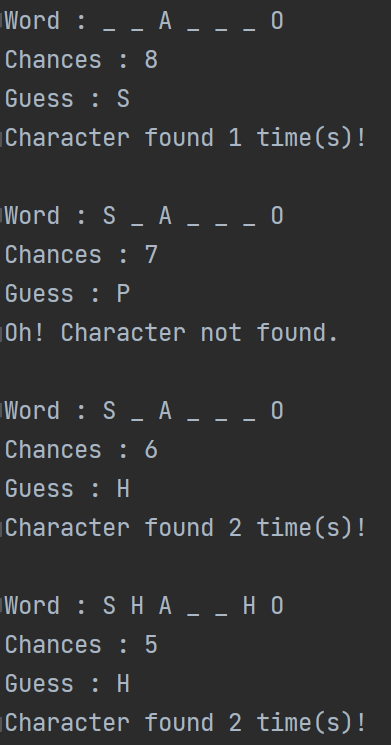

# Assignment / Task 2

## 2.1 getList()
Write a function
`List<Integer> getList(String s)`where :
- String s consists of integers separated by ';'

Your task is to create & return a List<Integer> which will contain all the integers present in string s.

Use String.split() function for this task. Learn [here](https://www.programiz.com/java-programming/library/string/split).

Example :

`getList("1;2;3;4") = List<Integer> {1, 2, 3, 4}`

---

## 2.2 getOccurrencesHashMap()
Write a function
`HashMap<Integer, Integer> getOccurrencesHashMap(String s)`where :
- String s consists of integers separated by ';'

Your task is to create & return a HashMap<Integer, Integer> where :
- Entry.Key represent an integer present in string s
- Entry.Value represent the number of occurrences of that integer in string s

Example : 

`getOccurrencesHashMap("1;2;2;2;3;1") = HashMap<Integer, Integer> {1:2, 2:3, 3:1}`
because 1 occurs 2 times, 2 occurs 3 times and 3 occurs 1 time.

---

## 2.3 WordGuessGame
In this task you have to develop a game in which user has to guess an incomplete word (consonants omitted) shown. The game should work as follows :

- To start the game, call `startGame(String s)` and pass the word to be guessed.
- Write a function `startGame(String s)` in which,
- replace consonants in s with '_'
- chances = (noOfConsonantsInS + 3)  
- while(chances-- != 0),   
    - print s and take a character as input
    - if character exists in s, update s
    - break if entire word is guessed (User WINS!)
    
User loses if word is not guessed within the chances given.   

Example : startGame("SHAMBHO")

and so on...

You need not go as it is by the steps mentioned. It has been provided just for the sake of explanation. You are free to use your imagination at its best and build the game!